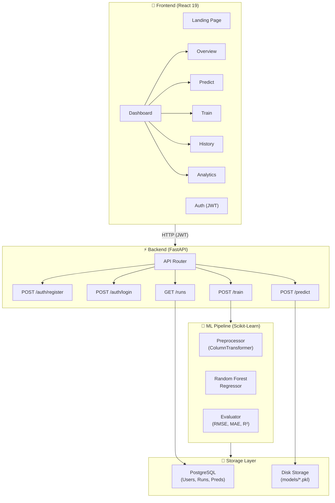

# 🚲 ElasticityAI: Bike Demand Forecasting

[](https://fastapi.tiangolo.com/)
[](https://reactjs.org/)
[](https://www.postgresql.org/)
[](https://scikit-learn.org/)

**ElasticityAI** is a premium, full-stack machine learning platform designed to model and predict bike-sharing demand elasticity. It combines a robust **Random Forest** regression pipeline with a high-performance **FastAPI** backend and a stunning **React** dashboard featuring glassmorphism design and real-time analytics.

---

## 🚀 Key Features

*   **End-to-End ML Pipeline**: Seamless integration of data cleaning, pipeline-based feature engineering (OneHotEncoding + StandardScaler), training, and evaluation.
*   **Dynamic Feature Selection**: Automatically filters user-selected features against uploaded datasets (`hour.csv` vs `day.csv`) to ensure zero-crash training.
*   **Premium Dashboard**: Modern React interface with glassmorphism effects, smooth animations, and a responsive sidebar.
*   **Real-time Analytics**: Interactive visualizations for seasonal demand trends, weather impact analysis, and model performance metrics.
*   **Persistent Model Management**: Automatically logs training metrics (RMSE, MAE, R²) and serializes model artifacts to disk.
*   **Demand Forecasting**: Instant hourly or daily predictions based on weather conditions and calendar features.

---

## 🏗️ Project Architecture



---

## 🛠️ Tech Stack

| Layer | Technology | Purpose |
| :--- | :--- | :--- |
| **Frontend** | React 19, React Router 7 | SPA with glassmorphism UI |
| **Styling** | Vanilla CSS3 | Custom design system with animations |
| **API** | FastAPI (Async) | High-concurrency REST endpoints |
| **Database** | PostgreSQL | Persistent metadata storage |
| **ML Engine** | Scikit-Learn, Pandas | Training & Preprocessing |
| **Auth** | JWT, Bcrypt | Secure user authentication |
| **ORM** | SQLAlchemy 2.0 (Async) | Asynchronous database interactions |

---

## 📁 Project Structure

```text
Bike-Demand-Elasticity-Modeling-/
├── backend/                # FastAPI Application
│   ├── db/                 # Database models & sessions
│   ├── ml/                 # ML pipeline (Preprocess, Train, Eval)
│   ├── routes/             # API endpoint handlers
│   └── main.py             # App entry point
├── frontend/               # React Application
│   ├── src/
│   │   ├── pages/          # Dashboard & Auth views
│   │   ├── api.js          # Centralized API client
│   │   └── index.css       # Premium Design System
├── data/                   # Dataset storage (hour.csv, day.csv)
├── models/                 # Serialized model artifacts (.pkl)
├── eda_plots/              # EDA visualization outputs
└── BikeRentalModel.ipynb   # Exploratory Data Analysis Notebook
```

---

## 🏁 Getting Started

### 1. Database Setup
Ensure PostgreSQL is running and create the database:
```sql
CREATE USER bikeuser WITH PASSWORD 'bike1234';
CREATE DATABASE bikedb OWNER bikeuser;
```

### 2. Backend Setup
```bash
python3 -m venv venv
source venv/bin/activate
pip install -r requirements.txt
# Configure backend/.env with your DATABASE_URL
python3 -m uvicorn backend.main:app --reload --port 8001
```

### 3. Frontend Setup
```bash
cd frontend
npm install
npm start
```

---

## 📡 API Endpoints

*   `POST /train`: Upload CSV and train a new model.
*   `POST /predict`: Generate demand forecast from features.
*   `GET /runs`: List all historical training runs and metrics.
*   `POST /auth/register`: Create a new user account.
*   `POST /auth/login`: Authenticate and receive JWT token.

---

## 📜 License
This project is licensed under the MIT License.
