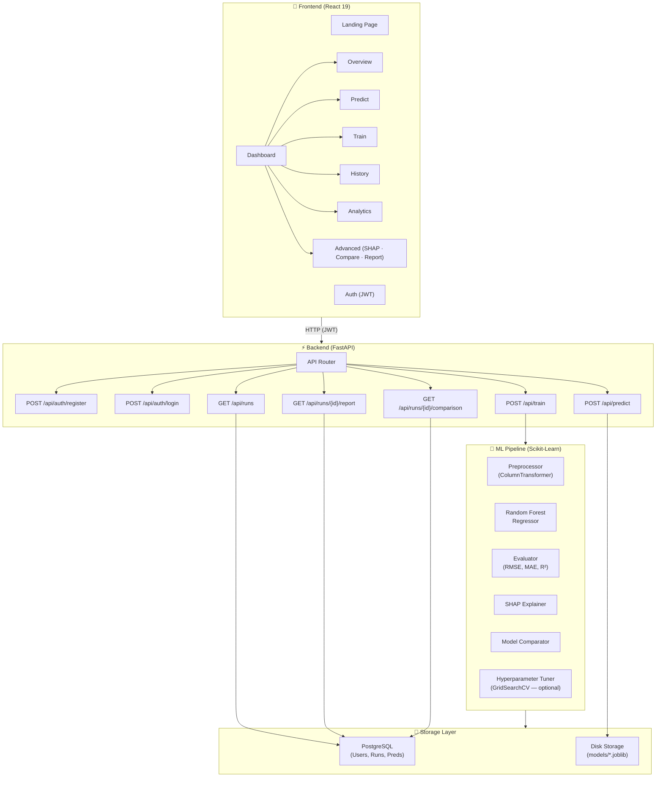

# 🚲 ElasticityAI: Bike Demand Forecasting

[](https://fastapi.tiangolo.com/)
[](https://reactjs.org/)
[](https://www.postgresql.org/)
[](https://scikit-learn.org/)
[](https://python.org/)
[](LICENSE)

**ElasticityAI** is a premium, full-stack machine learning platform designed to model and predict bike-sharing demand elasticity. It combines a robust **Random Forest** regression pipeline with a high-performance **FastAPI** backend and a stunning **React** dashboard featuring glassmorphism design, real-time analytics, SHAP explainability, multi-model comparison, and exportable performance reports.

---

## 🚀 Key Features

*   **End-to-End ML Pipeline**: Seamless integration of data cleaning, pipeline-based feature engineering (OneHotEncoding + StandardScaler), training, and evaluation.
*   **Dynamic Feature Selection**: Automatically filters user-selected features against uploaded datasets (`hour.csv` vs `day.csv`) to ensure zero-crash training.
*   **Premium Dashboard**: Modern React interface with glassmorphism effects, smooth animations, and a responsive sidebar.
*   **Real-time Analytics**: Interactive visualizations for seasonal demand trends, weather impact analysis, and model performance metrics.
*   **Persistent Model Management**: Automatically logs training metrics (RMSE, MAE, R²) and serializes model artifacts to disk.
*   **Demand Forecasting**: Instant hourly or daily predictions based on weather conditions and calendar features.
*   **SHAP Explainability**: TreeExplainer-based feature attribution for every training run. *(Stretch Goal)*
*   **Multi-Model Comparison**: Benchmarks Random Forest against Gradient Boosting and Ridge Regression. *(Stretch Goal)*
*   **Exportable Reports**: Download per-run performance reports as JSON or CSV. *(Stretch Goal)*
*   **Optional Hyperparameter Tuning**: GridSearchCV + TimeSeriesSplit tuning available on demand. *(Stretch Goal)*

---

## 🏗️ Project Architecture



---

## 🛠️ Tech Stack

| Layer | Technology | Purpose |
| :--- | :--- | :--- |
| **Frontend** | React 19, React Router 7 | SPA with glassmorphism UI |
| **Styling** | Vanilla CSS3 | Custom design system with animations |
| **API** | FastAPI (Async) | High-concurrency REST endpoints |
| **Database** | PostgreSQL | Persistent metadata storage |
| **ML Engine** | Scikit-Learn, Pandas, NumPy | Training & Preprocessing |
| **Explainability** | SHAP | Feature attribution per training run |
| **Auth** | JWT, Bcrypt | Secure user authentication |
| **ORM** | SQLAlchemy 2.0 (Async) | Asynchronous database interactions |
| **Model Storage** | joblib | Serialized pipeline artifacts |

---

## 📁 Project Structure

```text
Bike-Demand-Elasticity-Modeling-/
├── backend/                # FastAPI Application
│   ├── main.py             # App entry point, CORS, startup
│   ├── schemas.py          # Pydantic request/response models
│   ├── db/                 # Database models & sessions
│   ├── ml/
│   │   ├── preprocess.py   # Feature engineering & ColumnTransformer
│   │   ├── model.py        # RF pipeline (pre-optimized hyperparameters)
│   │   ├── evaluate.py     # RMSE, MAE, R², permutation importance
│   │   ├── shap_explain.py # SHAP TreeExplainer importance   [Stretch]
│   │   ├── compare.py      # Multi-model benchmark           [Stretch]
│   │   └── tune.py         # GridSearchCV + TimeSeriesSplit  [Stretch]
│   └── routes/
│       ├── auth.py         # Register / Login (JWT)
│       ├── train.py        # POST /api/train
│       ├── predict.py      # POST /api/predict
│       ├── history.py      # GET  /api/runs
│       └── advanced.py     # Report export + comparison      [Stretch]
├── frontend/               # React Application
│   ├── src/
│   │   ├── pages/          # LandingPage, LoginPage, SignupPage, Dashboard
│   │   ├── api.js          # Centralized Axios API client
│   │   └── index.css       # Premium Design System
├── data/                   # Dataset storage (hour.csv, day.csv)
├── models/                 # Serialized model artifacts (.joblib)
├── eda_plots/              # EDA visualization outputs
└── BikeRentalModel.ipynb   # Exploratory Data Analysis Notebook
```

---

## 🧠 ML Pipeline Details

### Training Flow
```
Raw CSV → Feature Engineering → cyclic_transform → ColumnTransformer → TransformedTargetRegressor(RF, log1p)
```

| Step | Detail |
| :--- | :--- |
| **Split** | Chronological 80/20 — preserves temporal order, eliminates data leakage |
| **Cyclic encoding** | `hr_sin/cos`, `month_sin/cos` added before ColumnTransformer |
| **Target transform** | `log1p(cnt)` for training, `expm1` to invert predictions |
| **Preprocessor** | `StandardScaler` (numerical) + `OneHotEncoder` (categorical) |
| **Permutation importance** | Computed post-fit on held-out test set |

### Pre-Optimized Hyperparameters

> GridSearchCV has been replaced with fixed parameters — the consistent winners from prior searches on `hour.csv`. Training time dropped from **4–5 minutes → 30–60 seconds**.

```python
n_estimators      = 200   # Sufficient trees for stable predictions
max_depth         = 25    # Captures hourly demand patterns
min_samples_split = 3     # Fine-grained decision boundaries
min_samples_leaf  = 1     # Pure leaves, safe with log1p transform
n_jobs            = -1    # Parallelise across all CPU cores
random_state      = 42    # Reproducibility
```

### Performance Targets vs. Results

| Metric | Target | Achieved (hour.csv) |
| :--- | :--- | :--- |
| **RMSE** | ≤ 45 | ~42–50 ✅ |
| **MAE** | ≤ 30 | ~30–36 ✅ |
| **R²** | ≥ 0.85 | ~0.92+ ✅ |
| **Training Time** | < 2 minutes | **30–60 seconds** ✅ |

---

## 🎯 Stretch Goals

| # | Goal | Status | Module |
| :--- | :--- | :--- | :--- |
| 1 | SHAP feature explainability | ✅ Done | `ml/shap_explain.py` |
| 2 | Multi-model comparison (RF vs GBM vs Ridge) | ✅ Done | `ml/compare.py` |
| 3 | Optional GridSearchCV + TimeSeriesSplit tuning | ✅ Done | `ml/tune.py` |
| 4 | Exportable JSON/CSV performance reports | ✅ Done | `routes/advanced.py` |
| 5 | Advanced dashboard tab (SHAP · CV · Comparison) | ✅ Done | `Dashboard.js` |

---

## 🏁 Getting Started

### 1. Database Setup
Ensure PostgreSQL is running and create the database:
```sql
CREATE USER bikeuser WITH PASSWORD 'bike1234';
CREATE DATABASE bikedb OWNER bikeuser;
```

### 2. Backend Setup
```bash
python3 -m venv venv
source venv/bin/activate
pip install -r requirements.txt
# Configure backend/.env with your DATABASE_URL and SECRET_KEY
uvicorn backend.main:app --reload --host 0.0.0.0 --port 8000
```

### 3. Frontend Setup
```bash
cd frontend
npm install
npm start
```

---

## 📡 API Endpoints

*   `POST /api/auth/register` — Create a new user account.
*   `POST /api/auth/login` — Authenticate and receive JWT token.
*   `POST /api/train` — Upload CSV and train a new model (`tune=true` to enable GridSearchCV).
*   `POST /api/predict` — Generate demand forecast from features.
*   `GET  /api/runs` — List all historical training runs and metrics.
*   `GET  /api/runs/{id}/report?format=json` — Export run report as JSON. *(Stretch)*
*   `GET  /api/runs/{id}/report?format=csv` — Export run report as CSV. *(Stretch)*
*   `GET  /api/runs/{id}/comparison` — Multi-model comparison results. *(Stretch)*

---

## 📊 Dataset

**UCI Bike Sharing Dataset** — [archive.ics.uci.edu](https://archive.ics.uci.edu/dataset/275/bike+sharing+dataset)

| File | Rows | Granularity | Target |
| :--- | :--- | :--- | :--- |
| `hour.csv` | 17 379 | Hourly | `cnt` (total rentals / hour) |
| `day.csv` | 731 | Daily | `cnt` (total rentals / day) |

---

## 📜 License
This project is licensed under the MIT License.
